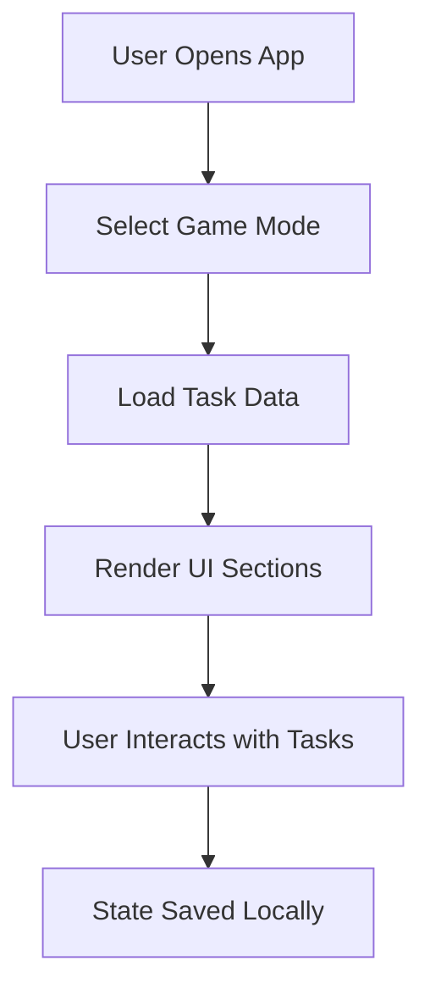

# 🧭 RSDailies

A clean, fast, browser-based RuneScape task tracker for managing your daily, weekly, monthly, and other activities.

---

## 📌 Table of Contents

- [Overview](#overview)
- [Preview](#preview)
- [Features](#features)
- [Game Modes](#game-modes)
- [How It Works](#how-it-works)
- [Project Structure](#project-structure)
- [Getting Started](#getting-started)

---

## 🧩 Overview

RSDailies is designed to help players quickly track repeatable in-game activities while providing a clean and user-friendly interface to be able to configure and manage a more personalized list.

---

## Features

- List of daily, weekly and monthly repeatable tasks for Runescape 3
- Added in a Timers (Farming) page
- Click the red area in right column (incomplete) to have "vanish" (completed)
- Brief comments on the benefits of completing the task
- Links to runescape.wiki or other relevant pages with further info
- Automatic countdown timer til the next reset time
- Once the reset time has past, completed tasks are automatically reset for you
- Saves what you checked off in the right column across visits in your browser's localStorage
- Drag and drop reordering (on desktop) that's saved so you can move the stuff you find more important to the top
- Links in nav to "more resources" that might be useful for gameplay information
- Tooltips on items showing more info
- Allows hiding of tasks and sections and saves preference in localStorage
- Multiple profile capability
- Ad free / tracking free

### Needs Added Back

- Makes profit calculations in "realtime" with data from [runescape.wiki GE API](https://runescape.wiki/w/User:Gaz_Lloyd/using_gemw#Exchange_API)

- Compact view mode

---

## 🖼️ Preview

### Main Tracker


### Farming Section


*(Replace images with your actual screenshots if needed)*

---

## ✨ Features

| Feature | Description |
|--------|------------|
| ✅ Task Tracking | Quickly check off tasks |
| 🌱 Timers | Timers for repeatable activites |
| 🔽 Collapsible Sections | Clean UI with expandable groups |
| 🔁 Reset Controls | Reset tasks instantly |
| 💾 Local Storage | Saves progress in browser |

---

## 🎮 Game Modes

| Mode | Status |
|------|--------|
| RS3 | ✅ Fully Supported |
| OSRS | ⚙️ Planned |

---

## ⚙️ How It Works



---

## 🏗️ Project Structure

```
src/
├── app/        # App boot & runtime
├── core/       # Shared utilities
├── data/       # Game data
├── features/   # Feature logic
├── ui/         # UI components
```

---

## 🚀 Getting Started

Install dependencies:

```bash
npm install
```

Run dev server:

```bash
npm run dev
```

Build project:

```bash
npm run build
```

Preview build:

```bash
npm run preview
```

---

## 💡 Notes

- No backend required
- Runs entirely in browser
- Easily extendable with new tasks and features

---

## 🧱 Built With

- Vite
- Vanilla JavaScript
- CSS

---
