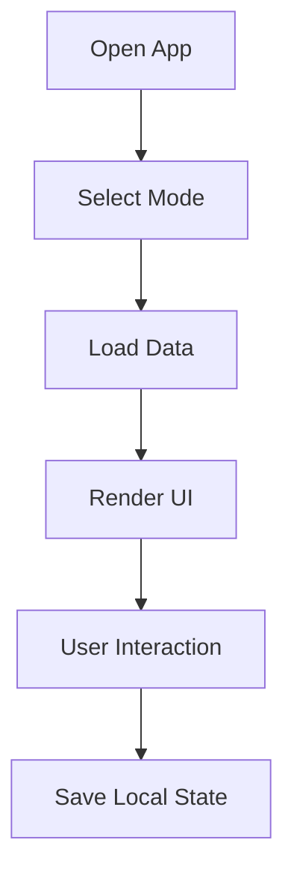

# 🧭 RSDailies


A lightweight RuneScape tracker for daily tasks, weekly resets, farming runs, timers, and repeatable account routines.

---

## 🔗 Live & Repository

- 🌐 **Live Site**: <https://rsdailies.github.io/RSDailies/>
- 💻 **Repository**: <https://github.com/rsdailies/RSDailies>

---

## 📌 Table of Contents

- [Overview](#overview)
- [Core Features](#core-features)
- [Planned Improvements](#planned-improvements)
- [Preview](#preview)
- [Website Features (Detailed)](#website-features-detailed)
- [Feature Summary](#feature-summary)
- [Game Modes](#game-modes)
- [How the App Works](#how-the-app-works)
- [Project Structure](#project-structure)
- [Getting Started](#getting-started)
- [Notes](#notes)
- [Built With](#built-with)
- [Legal](#legal)

---

## 🧩 Overview

RSDailies is designed to help players quickly track repeatable in-game activities while providing a clean and user-friendly interface to configure and manage a personalized list.

The current site focuses on RuneScape 3 tracking, with OSRS expansion planned. It includes grouped task sections, reset controls, collapsible headers, farming categories, and local browser persistence.

---

## Core Features

- Daily / Weekly / Monthly task tracking
- Farming timers and categories
- Auto reset timers
- Local storage persistence
- Drag-and-drop ordering
- Tooltips and resource links
- Profiles and preferences
- Ad-free / tracking-free

---

## Planned Improvements

- Real-time profit calculations (GE API)
- Compact view mode

---

## 🖼️ Preview


---

## Website Features (Detailed)

| Area | Description |
|---|---|
| Landing selection | Choose RS3 or OSRS |
| Tracker | Core tracking system |
| Farming | Timer-based farming system |
| Profiles | User configurations |
| Settings | UI preferences |
| Views | Layout controls |
| Import/Export | Data portability |

---

## Feature Summary

| Feature | Description |
|--------|------------|
| ✅ Task Tracking | Track completion |
| 🌱 Timers | Farming timers |
| 🔽 Sections | Expand/collapse |
| 🔁 Reset | Reset tasks |
| 💾 Storage | Local persistence |

---

## Game Modes

| Mode | Status |
|---|---|
| RuneScape 3 | Active |
| OSRS | Planned |

---

## How the App Works



---

## Project Structure

```
assets/
docs/
src/
tools/
```

---

## 🚀 Getting Started

```bash
npm install
npm run dev
npm run build
npm run preview
```

---

## 💡 Notes

- Fully client-side
- No backend required
- Built for expansion

---

## 🧱 Built With

- Vite
- JavaScript
- CSS

---

## Legal

RuneScape is a trademark of Jagex Ltd. This project is not affiliated with Jagex.
