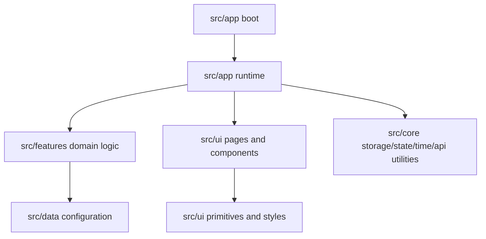
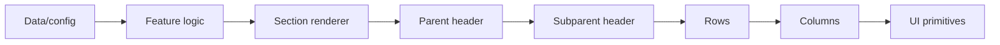

# RSDailies Architecture Authority Map

This document defines the current folder ownership rules for the RSDailies codebase.

The goal is to keep the tracker easy to maintain by making each top-level folder responsible for one clear part of the app.

---

## Top-Level Ownership

| Path | Owns |
|---|---|
| `assets/` | Static images, icons, and public assets served by Vite. |
| `docs/` | Current architecture, reference, and handoff documentation. |
| `src/app/` | App boot, composition, runtime wiring, scheduling, and orchestration. |
| `src/core/` | Shared non-visual utilities, storage, state, time helpers, IDs, API clients, and calculators. |
| `src/data/` | Game data and configuration shells for RS3 and OSRS. |
| `src/features/` | Feature/domain logic, controllers, state, calculations, and configuration. |
| `src/ui/` | All visual rendering, pages, components, primitives, HTML partials, and CSS. |
| `tools/` | Developer audit and verification scripts. |

---

## Boundary Rules

1. UI rendering belongs in `src/ui/`.
2. Shared non-visual helpers belong in `src/core/`.
3. Feature/domain behavior belongs in `src/features/`.
4. Game and task data belongs in `src/data/` or feature config folders.
5. Static images and icons belong in `assets/`.
6. Developer checks belong in `tools/`.
7. Documentation should stay current and useful.
8. Removed compatibility paths should not be recreated.
9. Broad rewrites should be avoided unless they are intentionally planned and verified.

---

## Runtime Flow



---

## Tracker Rendering Flow



---

## Tracker UI Systems

Tracker UI is organized under:

```text
src/ui/components/tracker/
├── farming/
├── parents/
├── rows/
├── sections/
├── subparents/
└── tables/
```

### Rows

```text
src/ui/components/tracker/rows/
├── row.constants.js
├── row.logic.js
├── row.render.js
├── row.styles.css
├── columns/
├── factory/
└── templates/
```

### Columns

```text
src/ui/components/tracker/rows/columns/
├── column.constants.js
├── column.logic.js
├── column.render.js
├── column.styles.css
├── hooks/
├── types/
└── utils/
```

Rows should use the column system instead of owning individual column internals directly.

---

## UI Rule

If a file renders markup, controls layout, or owns CSS behavior, it should live under `src/ui/`.

Examples:

- Headers
- Buttons
- Rows
- Tables
- Menus
- Modals
- Section renderers
- Page selection UI
- App shell HTML/CSS

---

## Feature Rule

If a file decides app behavior but does not render UI, it should live under `src/features/`.

Examples:

- Section state logic
- Settings controllers
- View controllers
- Farming timer math
- Profile stores
- Task configuration adapters

---

## Core Rule

If a file is reusable, non-visual, and not tied to one feature, it should live under `src/core/`.

Examples:

- Storage helpers
- Time formatting
- Countdown helpers
- DOM utilities
- ID helpers
- API wrappers
- Shared calculators

## What This Document Is For

- **Stops random folder sprawl** - keeps files in predictable places
- **Guides AI edits** - ensures AI knows where each piece of code belongs
- **Sets boundaries** - clear rules about what belongs in UI vs. features vs. core
- **Supports staged improvements** - allows targeted cleanup passes without breaking everything
- **Keeps maintenance clear** - easy to know where to look when bugs or missing features pop up

This document is the **contract** between you and future developers (including AI).

If you want to change this file later, you should:

1. Plan the change intentionally
2. Update the rules
3. Verify that the site still builds and works
4. Update screenshots or examples if necessary

---

## How To Use This Today

When you add or modify code:

1. Ask yourself:
   - Is this UI or logic?
   - Is it reusable or feature-specific?
   - Does it belong in `ui`, `features`, or `core`?
2. Update the appropriate file
3. Verify the change works
4. If the change is significant, update this document with the new structure

---

## What This Document Is Not For

- **Not a style guide** - use `src/ui/styles/` for that
- **Not a full API reference** - use code comments and JSDoc
- **Not a design spec** - use `docs/design` if you want visual mockups
- **Not a strict template** - you can add folders inside these paths (e.g. `src/ui/components/tracker/rows/columns/types/`)
